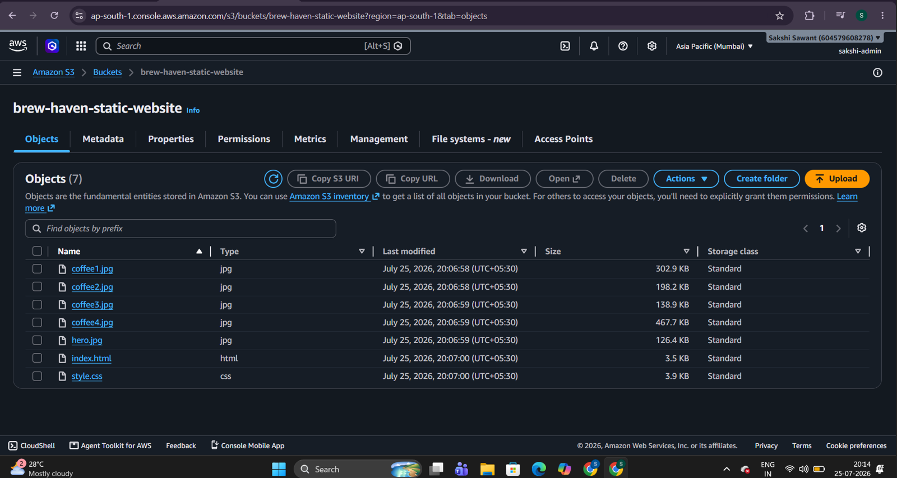
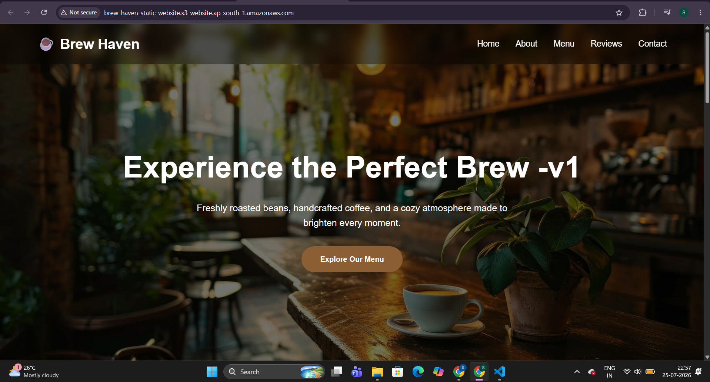
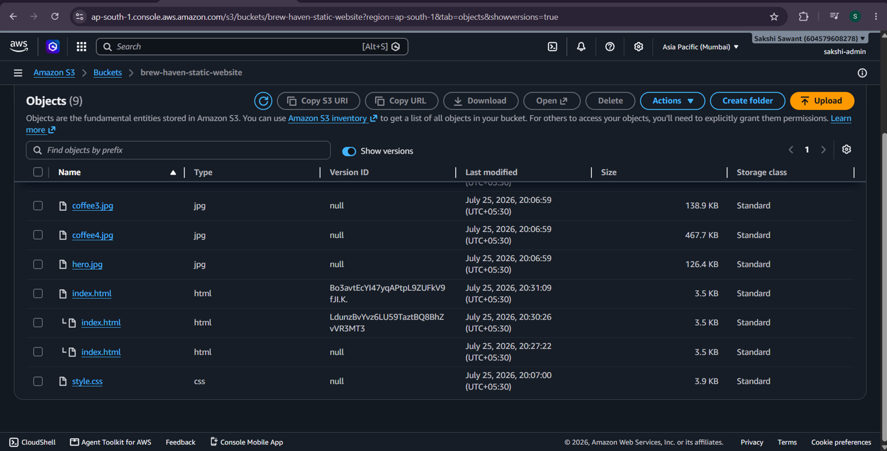
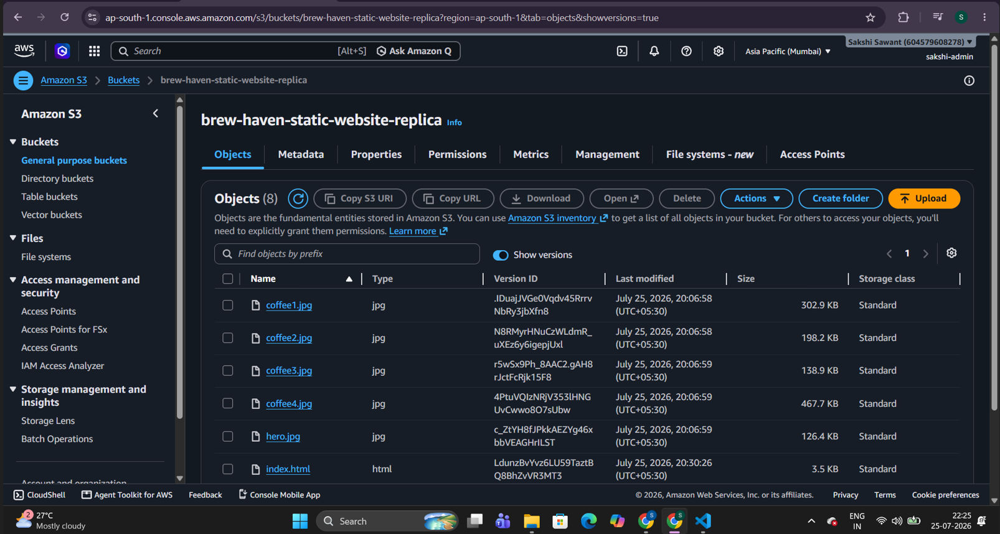
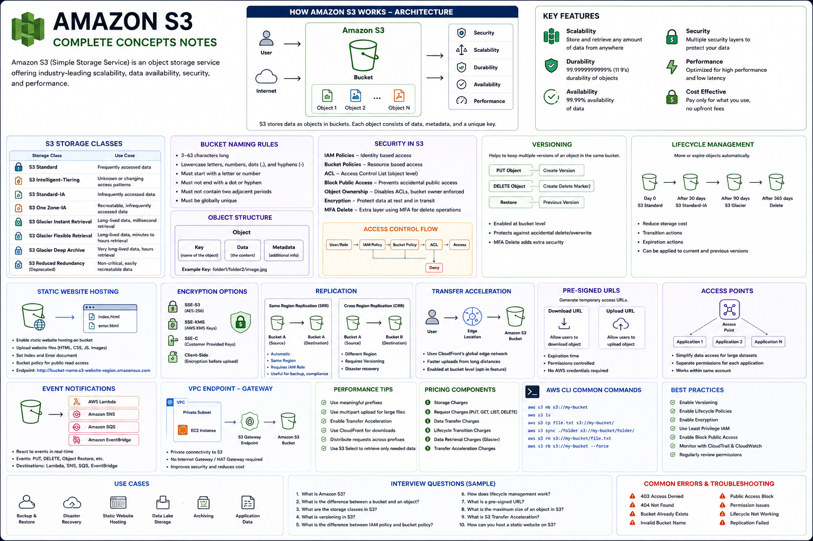

# ☁️ AWS S3 Static Website Hosting


Deploying a static website using **Amazon S3 Static Website Hosting** while exploring core Amazon S3 concepts such as **Buckets, Bucket Policies, Versioning, Replication, and Object Storage**.

---

# 📑 Table of Contents

- Project Overview
- Architecture
- AWS Services Used
- Project Features
- Folder Structure
- Deployment Steps
- Screenshots
- Learning Outcomes
- Future Improvements
- Author

---

# 📌 Project Overview

This project demonstrates how to host a static website using **Amazon S3**.

The project covers not only website hosting but also important Amazon S3 features used in real-world cloud environments.

### Topics Covered

- Amazon S3
- Buckets & Objects
- Static Website Hosting
- Bucket Policies
- Versioning
- Replication
- Object Storage

---

# 🏗️ Architecture

<p align="center">

</p>

### Architecture Flow

```
                User
                  │
                  ▼
              Internet
                  │
                  ▼
          Amazon S3 Bucket
                  │
                  ▼
      Static Website Hosting
                  │
                  ▼
         Brew Haven Website
```

---

# ☁️ AWS Services Used

| Service | Purpose |
|----------|---------|
| Amazon S3 | Object Storage |
| S3 Bucket | Website Storage |
| Bucket Policy | Public Website Access |
| Static Website Hosting | Website Hosting |
| Versioning | Protect Object Versions |
| Replication | Copy Objects to Replica Bucket |

---

# ✨ Project Features

- Static Website Hosting
- Public Website Access
- Bucket Policy Configuration
- Object Storage
- Versioning Enabled
- Replication Configured
- Website Endpoint Hosting

---

# 📂 Project Structure

```text
AWS-S3-Static-Website-Hosting
│
├── architecture
│   └── s3-static-website-architecture.png
│
├── website
│   ├── index.html
│   ├── style.css
│   ├── hero.jpg
│   ├── coffee1.jpg
│   ├── coffee2.jpg
│   ├── coffee3.jpg
│   └── coffee4.jpg
│
├── screenshots
│   ├── 01-s3-bucket.png
│   ├── 02-live-website.png
│   ├── 03-versioning.png
│   ├── 04-replication.png
│   └── 05-s3-notes.png
│
├── docs
│   ├── 01-Introduction-to-S3.md
│   ├── 02-Buckets-and-Objects.md
│   ├── 03-Versioning.md
│   ├── 04-Replication.md
│   ├── 05-Static-Website-Hosting.md
│   └── 06-Best-Practices.md
│
└── README.md
```

---

# 🚀 Deployment Steps

## Step 1

Create an Amazon S3 Bucket.

---

## Step 2

Upload website files.

```
index.html
style.css
hero.jpg
coffee1.jpg
coffee2.jpg
coffee3.jpg
coffee4.jpg
```

---

## Step 3

Disable Block Public Access.

---

## Step 4

Enable Static Website Hosting.

Configure:

- Index Document

```
index.html
```

- Error Document

```
error.html
```

---

## Step 5

Configure Bucket Policy.

Example:

```json
{
  "Version":"2012-10-17",
  "Statement":[
    {
      "Sid":"PublicReadGetObject",
      "Effect":"Allow",
      "Principal":"*",
      "Action":"s3:GetObject",
      "Resource":"arn:aws:s3:::YOUR-BUCKET-NAME/*"
    }
  ]
}
```

---

## Step 6

Open the Website Endpoint.

Website becomes publicly accessible.

---

## Step 7

Enable Versioning.

Protects objects from accidental deletion and overwrite.

---

## Step 8

Configure Replication.

Replicate objects to another S3 bucket.

---

# 📸 Screenshots

## Architecture


---

## Source Bucket



---

## Live Website



---

## Versioning Enabled



---

## Replication



---

## Amazon S3 Notes



---

# 📚 Learning Outcomes

Through this project, I learned:

- Amazon S3 Fundamentals
- Object Storage
- Buckets & Objects
- Bucket Policies
- Static Website Hosting
- Website Endpoints
- S3 Versioning
- S3 Replication
- Public Website Configuration

---

# 💡 Challenges Faced

- Configuring Bucket Policy correctly
- Understanding Block Public Access
- Hosting the website publicly
- Configuring Versioning
- Setting up Replication

---

# 🚀 Future Improvements

This project will be upgraded with:

- Amazon CloudFront
- Route 53
- HTTPS (AWS Certificate Manager)
- Private S3 Bucket
- Origin Access Control (OAC)
- Custom Domain

---

# 🛠️ Technologies Used

- Amazon S3
- HTML
- CSS
- AWS Management Console

---

# 👨‍💻 Author

**Sakshi Sawant**

Cloud Computing Enthusiast ☁️

GitHub: https://github.com/sakshisawant12

LinkedIn: *(Add your LinkedIn profile here)*

---

## ⭐ If you found this project helpful, consider giving it a Star!
